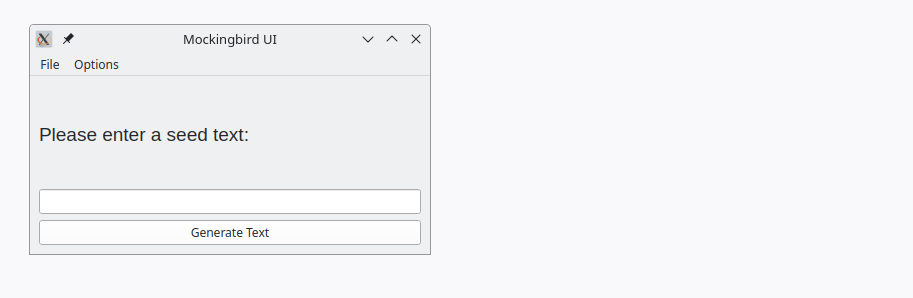
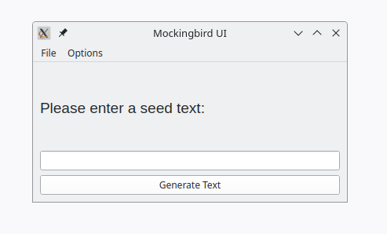
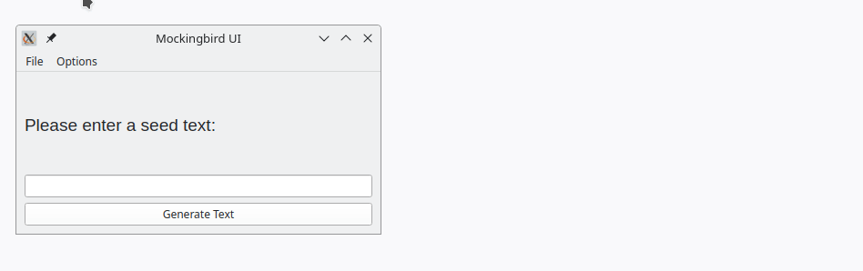

# Table of Contents

1.  [Installation instructions:](#orgd20d8d7)
    1.  [Install dependencies](#org7a4f32b)
        1.  [Install latest python and pip](#orgd35df2d)
    2.  [Run Mockingbird](#orgaca9659)

An implementation of LSTMs and Markov Chains for NLG tasks in a PyQt5 UI.


<a id="orgd20d8d7"></a>

# Installation instructions:


<a id="org7a4f32b"></a>

## Install dependencies


<a id="orgd35df2d"></a>

### Install latest [python](https://www.python.org/) and pip

``` sh
pip install markovify openai transformers language_tool_python pyqt5 requests requests_oauthlib
```


<a id="orgaca9659"></a>

## Run Mockingbird

``` sh
python gui.py
```

### Generate text



1. Enter text to be used as a seed phrase
2. Click Generate Text
3. Optionally edit text
4. Choose to post, regenerate or cancel

### Change between NLG algorithms/models



1. Click Options > Model/Dataset
2. Choose between desired algorithm

### Setup API Keys



1. Acquire Twitter Consumer Key and Consumer Secret
2. Click Options > API Options 
3. Enter the aforementioned keys
4. Click Apply
